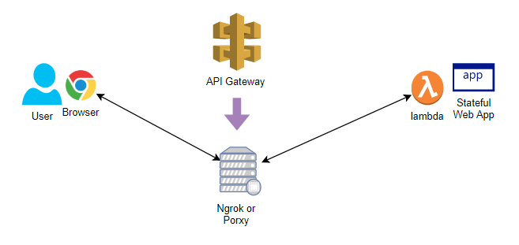

# lambda-ngrok-architecture

Use lambda with HTTPS without using AWS API Gateway.  
This is a sample application.

## Overview



## Summary
### Lambda + API Gateway 's Limitation

- It requires the **stateless** web applicaiton on lambda.
- API Gateway rewrites the normal authenticaiton header.
- API Gateway does not support websock.
- API Gateway has a timeout limit (max. 30sec.).
- ~~API Gateway scales the lambda instances. You cannot expect sticky request routing.~~

### Lambda + Ngrok 's Benefit

- You can run a **stateful** web application on lambda.
- You can use the app with basic authentication.
- You can use the app with websock.
- You can solve the timeout limit of API Gateway.
- You can ignore the auto scaling behaviour.

## Prerequire

- setup serverless and AWS credential configuration

## Quick Start

1. Clone this repogitry and deploy with serverless command.
    ```
    git clone https://github.com/sakazuki/lambda-ngrok-architecture.git`
    cd lambda-ngrok-architecture
    npm install
    sls deploy
    ```
1. Update environment variables on Lambda Mangement Console
    - BASIC_PASSWORD: Basic authentication password
    - SLACK_URL: Slack incoming hook URL
1. Execute the lambda function (with Test or else)
1. Check a slack message and access ngrok URL (https://xxxx.ngrok.com/)
1. Input `admin` and the above BASIC_PASSWORD.
1. Reload the page any time and check the content change
1. Access `/bye` URL to stop the lambda function.

## Explain

See [handler.js](./handler.js)

1. Start a express server and listen on some port.
1. Connect the port to ngrok and get a new URL.
1. Notify the URL to users via Slack.
1. Handle user's HTTP requests.
    1. Send a dynamic content when it receives a `/` request.
    1. Quit when it receives a `/bye` request.

## Dependency

- ngrok https://ngrok.com/
- serverless https://serverless.com/